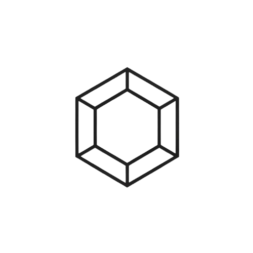

<picture>
  <source media="(prefers-color-scheme: dark)" srcset="./docs/assets/me.png" />
  
</picture>

# .me

**Own your knowledge.**

Your *identity* unified in **one reactive graph.**

<h4 align="center"><a href="https://neurons-me.github.io/.me/docs">⌬ Docs</a>  <a href="https://neurons-me.github.io/.me/docs/">⬡ Getting Started</a></h4>

### Demos 𓂃𓂃𓂃𓂃𓂃𓂃𓂃𓂃𓂃𓂃𓂃𓂃𓂃𓂃𓂃𓂃

𓅓 **[Robots That Understand Context](https://neurons-me.github.io/.me/docs/Robots-That-Understand-Context.html)**  ⟐🤖 ⇄ ⇆ 🤖⟐ Same object, different meaning.

𓊖 **[Smart City](https://neurons-me.github.io/.me/docs/Smart-Cities.html)** ∴ 🏙️ ◉ 📡  ⌬ A full city reacting in real time as interconnected nodes.

𓀠 **[Social Graph](https://neurons-me.github.io/.me/docs/Social-Graph.html)** ⟐👤 ⇄ 👥⌬ ∴ Relationships, trust, identity, and network effects.

𓉝 **[Running your CoffeeShops](https://neurons-me.github.io/.me/docs/Running-your-CoffeeShops.html)** 🏪 ⇄ 📈 Inventory, operations, and business state as a graph.

𓋹 **[Splitting your Bill](https://neurons-me.github.io/.me/docs/Splitting-your-Bill.html)** 💳 ⇄ 👥 ⌬ ⚖️ ∴ Shared expenses and automatic settlement logic.

𓇳 **[Hemisphere Scale](https://neurons-me.github.io/.me/docs/Hemisphere-Scale.html)** 🌐 ⇄ ⌬ 𓇳 ⌬ ⇄ 🌐  1 million nodes with cross-domain reactive updates.

𓂀 **[Extreme Fan-Out](https://neurons-me.github.io/.me/docs/Extreme-Fan-Out.html)** ⚡⚡⚡ ⟶ ⌬⌬⌬⌬ One write instantly updates 100k dependents.

**[ ⌬ ⊚ View all demos → ](https://github.com/neurons-me/.me/tree/main/Typescript/tests/Demos)**

---

### Syntax

`.me` uses an infinite proxy — any path you write becomes a node in the graph.
No schema. No migrations. No declarations upfront.

```ts
me.city.population = 700_000
me.city.name = "Veracruz"

// derived — recomputes automatically
me.city.density = () => me.city.population / me.city.area

// context-aware
me.robot.canProceed = () => me.robot.canLift && !me.robot.needsHumanReview

// stealth — structurally invisible to outside observers  
me.wallet["_"].balance = 1000

// explain any value
me.explain("city.density")
// → { value: 3500, expression: "population / area", dependsOn: [...] }

// query across the graph
me.robots[r => r.canProceed === true].name
```

Write anything. Chain anything. The kernel figures out the dependencies.
**If it changes, everything that depends on it updates — automatically.**

## **▵** Why .me?

1. **Structural Privacy** — Private data is structurally invisible (not just hidden by rules).
2. **Full Explainability** — Every derived value can explain exactly how it was computed.
3. **Subjective Reality** — Same graph, different views per agent.

> **Local compute makes memory an OS primitive.**  
> Cloud makes it a service.

Even with 100,000 nodes needing a simultaneous recompute, you're looking at about **62 microseconds per node** (6252ms / 100k) for the full propagation. That’s incredibly consistent.

The same object can mean completely different things depending on context — and everything updates automatically when something changes. 

### Real Performance

**.me** uses **true O(K) reactivity** — when a value changes, only its actual dependents update. *Not the whole graph.*

- 1 million nodes in memory
- 1 sensor changed → exactly **6 dependent nodes** recomputed
- Time to propagate: **0.256ms**
- K=6 out of 1,000,000 — the rest of the graph is untouched

Scale the graph to 10 million nodes — if your change has 6 dependents, it still takes the same time.
**Data that thinks. Logic that explains itself.**

---

**𓅓 Own your intelligence.**

**suiGn**
MIT License © 2025 · [neurons.me](https://neurons.me)

<p align="center">
  <a href="https://neurons.me/">
    
  </a>
</p>
