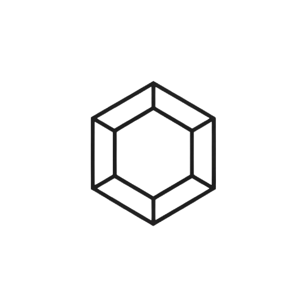
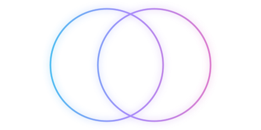

<div class="readme-intro">

# .me

**Own your knowledge.**

</div>

<div class="static-hero">
<table border="0" cellspacing="0" cellpadding="0" style="border:none; margin:0;">
  <tr>
    <td width="260" align="center" valign="middle">
      <picture>
        <source media="(prefers-color-scheme: dark)" srcset="https://res.cloudinary.com/dkwnxf6gm/image/upload/v1760915741/this.me-removebg-preview_1_nrj6pe.png" />
        
      </picture>
      <div title="ID Hash: keccak256(&quot;this.me/identity:v1::.me&quot;)" style="margin-top:6px; font-family:monospace; font-size:0.65rem; color:#6b7280; opacity:0.75; letter-spacing:0.02em;">0dec8214…a292d7</div>
      <a href="https://neurons-me.github.io/.me/docs/Seed.html" target="_blank" title="identityHash = keccak256(&quot;this.me/identity:v1::&quot; + seed) — read the SEED doc" style="display:block; margin-top:2px; font-family:monospace; font-size:0.6rem; color:#58a6ff; letter-spacing:0.03em; text-decoration:underline;" rel="noopener noreferrer">keccak-256</a>
    </td>
    <td valign="middle">
      <h2>Hello, I am .me</h2>
      <p>
        <h6>
          A Cryptographic Identity.
      </h6>
      </p>
      <h3><a href="https://neurons-me.github.io/.me/docs" target="_blank" rel="noopener noreferrer">⌬ Docs</a>   </h3>
      <p style="font-family:monospace; font-size:0.7rem; color:#8b949e;">→ Watch the hash: <a href="https://neurons-me.github.io/.me/" target="_blank" rel="noopener noreferrer">neurons-me.github.io/.me</a></p>
    </td>
  </tr>
</table>
</div>


## What is .me

`.me` is a declarative language for building an infinite semantic tree — a universe of meaning — and querying it by path.

### Declare meaning

Any path is valid — `me.any.depth.path(...)` — because you invent the graph as you write it.

```ts
me.profile.name("Abella.e")
```

### Resolve meaning

You resolve inside a <a href="https://neurons-me.github.io/Namespace.html" target="_blank" rel="noopener noreferrer">namespace</a> — the name of the place, the place of the name.

```ts
me("profile.name") // "Abella.e"
```

`me.whatever(what)` — every call is Subject-Verb-Object, plus an operator table: <code style="color:#f472b6;font-weight:600;">@</code> identity, <code style="color:#f472b6;font-weight:600;">_</code> secret, <code style="color:#f472b6;font-weight:600;">-&gt;</code> link (not a copy), <code style="color:#f472b6;font-weight:600;">=</code> derived rule. One kernel, real lines:

```ts
me["@"]("jabellae");
me.wallet["_"]("wallet-key");
me.friends.ana["->"]("users.ana");
me.friends["[i]"]["="]("isAdult", "age >= 18");
```

Full grammar, the operator table, and a how-to: **<a href="https://neurons-me.github.io/me.whatever.what.html" target="_blank" rel="noopener noreferrer">me.whatever(what)</a>**.

## ⚡ Get .me started!

Clone the repo, pick a runtime:<br>
🔷 TypeScript, 🦀 Rust, 🐍 Python<br>
**<a href="https://neurons-me.github.io/Get.me.started.html" target="_blank" rel="noopener noreferrer">Full walkthrough →</a>**

```ts
me["@"]("abella") // you are Abella
```

#### <a href="https://neurons-me.github.io/.me/docs/Social-Graph.html" target="_blank" rel="noopener noreferrer">𓀠 ⟐👤 ⇄ 👥 ⌬ ∴ 𓀠 Social Graph</a> — 🪪 Identity, 🤝 trust, and 🧑‍🤝‍🧑 relationships.

```ts
me.friends.ana["->"]("users.ana")
me.users["[i]"]["="]("isAdult", "age >= 18")
me("friends[isAdult == true].name")
// -> { ana: "Ana", luisa: "Luisa" }
```

*Pablo turns 18. Who's on the list now?* 🧒 → 🧑

```ts
me.users.pablo.age(18)
me("friends[isAdult == true].name")
// -> { ana: "Ana", pablo: "Pablo", luisa: "Luisa" }
```

Trust isn't stored, it's computed fresh from whatever's true right now — which is exactly what lets the same graph decide who's on tonight's guest list and, a page later, who owes rent. **<a href="https://neurons-me.github.io/.me/docs/Social-Graph.html" target="_blank" rel="noopener noreferrer">See the full Social Graph demo.</a>**

#### <a href="https://neurons-me.github.io/.me/docs/Splitting-your-Bill.html" target="_blank" rel="noopener noreferrer">💳 ⇄ 👥 ⌬ ⚖️ ∴ Splitting your Bill</a> — 💸 Shared expenses, ➗ split automatically, ✅ settled.

```ts
me.wallets.vancouver["="]("per_person", "total / members.count")
me.wallets.vancouver["="]("balance_ana", "paid.ana - per_person")
me("wallets.vancouver.balance_ana")
// -> -100
```

*Ana pays $90 for dinner. New balance?* 👩🍽️ → 🪙🪙💵

```ts
me.wallets.vancouver.paid.ana(90)
me.wallets.vancouver.total(390)
me("wallets.vancouver.balance_ana")
// -> -40
```

A balance sheet for three friends and a settlement engine for a hundred-person retreat are built from identical arithmetic — only the numbers get bigger. **<a href="https://neurons-me.github.io/.me/docs/Splitting-your-Bill.html" target="_blank" rel="noopener noreferrer">Walk through Splitting the Bill.</a>**

#### <a href="https://neurons-me.github.io/.me/docs/Running-your-CoffeeShops.html" target="_blank" rel="noopener noreferrer">🏪 ⇄ 📦 ⇄ 📈 CoffeeShops</a> — ☕ Inventory and 📦 operations as a graph.

```ts
me.shops["[i]"].menu["="]("breakfastDeal", "latte + espresso - 1.5")
me.shops["[i]"].menu["="]("isPremium", "breakfastDeal > 6.5")
me("shops[menu.isPremium == true].name")
// -> { 2: "Riverside", 3: "Station" }
```

*Downtown's latte goes to $5.10. Premium now?* 🌆☕ 📈 → ⭐

```ts
me.shops[1].menu.latte(5.1)
me("shops[menu.isPremium == true].name")
// -> { 1: "Downtown", 2: "Riverside", 3: "Station" }
```

Swap "latte" for any SKU and a franchise-wide pricing rule falls out of the exact same three lines — and the next section prices something that isn't a drink at all. **<a href="https://neurons-me.github.io/.me/docs/Running-your-CoffeeShops.html" target="_blank" rel="noopener noreferrer">Explore CoffeeShops end to end.</a>**

#### <a href="https://neurons-me.github.io/.me/docs/Robots-That-Understand-Context.html" target="_blank" rel="noopener noreferrer">⟐🤖 ⇆ 🤖⟐ Robots That Understand Context</a> — 🤖 Same object, 🧠 different meaning.

```ts
me.robots.surgeon.target["->"]("objects.canister7")
me.robots["[i]"]["="]("canProceed", "canLift && softGripReady && !needsHumanReview && contextAllowsMotion")
me("robots.surgeon.canProceed")   // -> false
```

*Sterilize the canister. Does the surgeon clear now?* 🧼 → ✅

```ts
me.objects.canister7.sterile(true)
me("robots.surgeon.canProceed")   // -> true
```

A surgical robot checking whether a canister was sterilized is really just a permission check — the same kind that could clear a forklift, a drone, or a locked door, scaled from one canister to an entire city. **<a href="https://neurons-me.github.io/.me/docs/Robots-That-Understand-Context.html" target="_blank" rel="noopener noreferrer">Read Robots That Understand Context.</a>**

#### <a href="https://neurons-me.github.io/.me/docs/Smart-Cities.html" target="_blank" rel="noopener noreferrer">∴ 🏙️ ◉ 📡 ⌬ Smart City</a> — 🏙️ A city reacting as one 🔗 connected graph.

```ts
me.districts["[i]"]["="]("overCapacity", "currentLoad > capacity")
me("districts[overCapacity == true].name")
// -> { 3: "Veracruz Puerto" }
```

*Security is declared under `_`. What does a guest see?* 🔒 → 🙈

```ts
me.security["_"]("city-security-ops-2026")
me.security["="]("alertLevel", "incidentsToday > 2")
me.as(null)("security.alertLevel") // -> undefined
me("security.alertLevel")          // -> true
```

A city's incident board and a hospital's are the same shape, different stakes, same rule for who's cleared to see it — and the same shape scales from a handful of districts to a million sensors. **<a href="https://neurons-me.github.io/.me/docs/Smart-Cities.html" target="_blank" rel="noopener noreferrer">Dig into Smart Cities.</a>**

#### <a href="https://neurons-me.github.io/.me/docs/Hemisphere-Scale.html" target="_blank" rel="noopener noreferrer">🌐 ⇄ ⌬ 𓇳 ⌬ ⇄ 🌐 Hemisphere Scale</a> — 📡 1 million sensors. ⚡ One flips. 🎯 Only 6 recompute. The other 999,994 untouched. That's **<a href="https://neurons-me.github.io/.me/docs/Architecture.html" target="_blank" rel="noopener noreferrer">O(k)</a>.**

`.me` uses true O(K) reactivity — when a value changes, only its actual dependents update, not the whole graph. Local compute makes that an OS primitive; cloud makes it a service.

```ts
me.geo[777777]["="]("blackout", "!powerUp")
me.services["="]("generatorMode", "traffic.emergencyReroute")
```

*One sensor flips, out of 1,000,000. How many recompute?* ⚡ → 🎯

```ts
me.geo[777777].powerUp(false)
me.explain("services.generatorMode").meta.k
// -> 6
```

That gap is the whole argument for running a sensor network this size live. Extreme Fan-Out flips the question: what if *k* itself is the huge number?

```
GRAPH       1,000,000 nodes   (~533MB heap)
TRIGGER     1 sensor flips
RECOMPUTE   6 nodes           K = 6
UNTOUCHED   999,994 nodes
LATENCY     4.346ms
AT 10M      same K, same latency
```

**<a href="https://neurons-me.github.io/.me/docs/Hemisphere-Scale.html" target="_blank" rel="noopener noreferrer">Follow the full Hemisphere Scale walkthrough.</a>**

#### <a href="https://neurons-me.github.io/.me/docs/Extreme-Fan-Out.html" target="_blank" rel="noopener noreferrer">⚡⚡⚡ ⟶ ⌬⌬⌬⌬ Extreme Fan-Out</a> — ✍️ One write updates 📡 100k dependents.

```ts
me.master.factor(1)
me.dep[i]["="]("out", "value * master.factor") // 100,000 of these
me("dep[1].out") // -> 1
```

*Same trick, 100,000 dependents this time. How many recompute now?* 🔁 → 🎯

```ts
me.master.factor(2)
me.explain("dep[100000].out").meta.k
// -> 100000
```

One edit, and whole catalogs reprice or whole dashboards refresh, without anyone re-running anything by hand.

```
DEPENDENTS  100,000          worst case, all genuine
LATENCY     21,283ms total
PER-NODE    ~213μs
```

See **<a href="https://suign.github.io/WhatIsOK.html" target="_blank" rel="noopener noreferrer">What is O(k)?</a>** for the full, verified benchmark table. **<a href="https://neurons-me.github.io/.me/docs/Extreme-Fan-Out.html" target="_blank" rel="noopener noreferrer">Trace Extreme Fan-Out.</a>**

**<a href="https://github.com/neurons-me/.me/tree/main/Typescript/tests/Demos" target="_blank" rel="noopener noreferrer">⌬ ⊚ View all demos →</a>**

**Data that thinks. Logic that explains itself.**

<p align="center">
  
</p>

## 𓂀 Syntax: Algebra of Digital Spaces

**Subject.me Verb.whatever Object.what** — `me.whatever(what)`

`me://` sits on a namespace — which tree of meaning you're addressing, resolved over <a href="https://neurons-me.github.io/NRP/" target="_blank" rel="noopener noreferrer">NRP</a> from identity. Who's allowed to read what inside that tree: two <a href="https://suign.github.io/EncryptedIsland.html" target="_blank" rel="noopener noreferrer">islands</a> share only the exact <a href="https://suign.github.io/DigitalSpaceAlgebra.html" target="_blank" rel="noopener noreferrer">space</a> where they overlap, cryptographically, per the <a href="https://suign.github.io/SetChemistry.html" target="_blank" rel="noopener noreferrer">set-chemistry</a>.

```ts
me.islandA["_"]("keyA")
me.islandA.note("only A can read this")

me.shared["->"]("islandA")           // a pointer between branches

me("shared.note")                     // -> "only A can read this"
me.as("keyB")("shared.note")          // -> undefined — wrong audience, even through the pointer
```

`_` = audience, not policy — a key derives the value or it doesn't. `manifest(p | o) ≠ value(p)`: same tree, different reality per `o`. That's 2 of 5 operators — full breakdown: **<a href="https://neurons-me.github.io/.me/Typescript/typedocs/Operators.html" target="_blank" rel="noopener noreferrer">Operators & Logic</a>**.

Developers may *recognize the idea* more quickly written like this:

```ts
me.city.population = 700_000
me.city.area = 200
me.city.density = () => me.city.population / me.city.area
```

### Language-agnostic

`.me` isn't English underneath — it's structure. Swap the vocabulary and the algebra doesn't change:

```ts
me.shop.items[1].price(100)
me.tienda.articulos[1].precio(100)
me.店舗.商品[1].価格(100)
```

Three languages, three developers, one identical node. **Meaning is structure, not vocabulary** — the same reason a human writing Spanish and an agent writing English can resolve the same graph without translating anything.

**Full spec**: `me --describe syntax` and <a href="https://neurons-me.github.io/.me/docs/Syntax.html" target="_blank" rel="noopener noreferrer">Syntax reference</a>

## **▵** me.explain(Why Did You Say That?)

**Full Explainability** — Every derived value can explain exactly how it was computed.

***Ai*** can describe its reasoning, but that description is still generated by the same system being questioned.

`.me` returns the computation itself.

```ts
me.explain("robots.surgeon.canProceed")
{
  value: true,
  expr: "canLift && softGripReady && !needsHumanReview",
  dependsOn: [...]
}
```

`explain()` returns the expression actually evaluated and the inputs that produced it.

If no derivation exists, it returns none. If an input is secret, the value stays masked.

**Self-report describes the computation.** **`me.explain()`** **exposes its record.**

And `me["!"].prove()` can cryptographically sign that state.

**Explainability without asking the system to explain itself.**

---

**𓅓 Own your intelligence.**

**suiGn**
MIT License © 2025 · <a href="https://neurons.me" target="_blank" rel="noopener noreferrer">neurons.me</a>

<p align="center">
  <a href="https://neurons.me/" target="_blank" rel="noopener noreferrer">
    
  </a>
</p>
